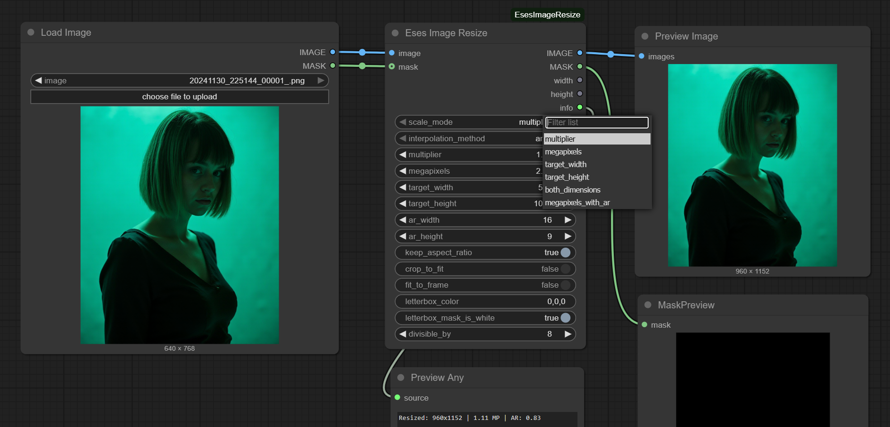

# Eses Image Resize




> [!CAUTION]
> Before downloading and using the contents of this repository, please review the LICENSE.txt and the disclaimer.
> I kindly ask that you respect the licensing terms and the effort put into these tools to ensure their 
> continued availability for everyone. Thank you!


## Description

The 'Eses Image Resize' node offers comprehensive image resizing capabilities within ComfyUI. It supports various scaling modes including scaling by a specific ratio, target megapixels, or directly to fixed dimensions. The node provides framing options to handle aspect ratio changes, allowing users to 'Crop to Fit' (fill) the target frame or 'Fit to Frame' (letterbox) the image with a customizable fill color. It also generates and outputs a corresponding mask, with control over the letterbox area's color (black or white) within the mask.

💡If you are looking for a single node that does pretty much *all the possible scaling related tasks*, with minimal dependencies, then why not give this one a try! 


## Features

* **Multiple Scaling Modes**:
    * `multiplier`: Resizes by a simple multiplication factor.
    * `megapixels`: Scales the image to a target megapixel count.
    * `megapixels_with_ar`: Scales to target megapixels while maintaining a specific output aspect ratio (width:height).
    * `target_width`: Resizes to a specific width, optionally maintaining aspect ratio.
    * `target_height`: Resizes to a specific height, optionally maintaining aspect ratio.
    * `both_dimensions`: Resizes to exact width and height, potentially distorting aspect ratio if `keep_aspect_ratio` is false.

* **Upscale Model Scaling (NEW)**:
    * `upscale_model`: Connect optional upscale model, and it will be used for upscaling, instead of interpolation algorithms. Note - final scaling step to target resolution is done using interpolation algorithms.

* **Aspect Ratio Handling**:
    * `crop_to_fit`: Resizes and then crops the image to perfectly fill the target dimensions, preserving aspect ratio by removing excess.
    * `fit_to_frame`: Resizes and adds a letterbox/pillarbox to fit the image within the target dimensions without cropping, filling empty space with a specified color.
* **Customizable Fill Color**:
    * `letterbox_color`: Sets the RGB/RGBA color for the letterbox/pillarbox areas when 'Fit to Frame' is active. Supports RGB/RGBA and hex color codes.
* **Mask Output Control**:
    * Automatically generates a mask corresponding to the resized image.
    * `letterbox_mask_is_white`: Determines if the letterbox areas in the output mask should be white (active) or black (inactive).
* **Dimension Rounding**:
    * `divisible_by`: Allows rounding of final dimensions to be divisible by a specified number (e.g., 8, 64), which can be useful for certain models.


## Requirements

* PyTorch – (you should have this if you have ComfyUI installed).


## Installation

1.  **Navigate to your ComfyUI custom nodes directory:**
    ```
    ComfyUI/custom_nodes/
    ```

2.  **Clone this repository:**
    ```
    git clone https://github.com/quasiblob/ComfyUI-EsesImageResize.git
    ```

3.  **Restart ComfyUI:**
    * After restarting, the "Eses Image Resize" node will be available in the "Eses Nodes/Image" category.


## Folder Structure

```
ComfyUI-EsesImageResize/
├── init.py                     # Main module defining the custom node.
├── image_resize.py             # The Python file containing the node logic.
├── LICENSE.txt                 # You should read this before using this node.
└── README.md                   # This file.
```


## Usage

* Connect an image to the `image` input. Optionally, connect a mask to the `mask` input if you wish for it to be resized alongside the image.
* Select your desired `scale_mode` and adjust the related parameters (e.g., `multiplier`, `megapixels`, `target_width`, `target_height`, `ar_width`, `ar_height`).
* Choose how the image should handle aspect ratio changes using `crop_to_fit` or `fit_to_frame`.
* Customize the `letterbox_color` and `letterbox_mask_is_white` settings if using `fit_to_frame`.
* The node will output the resized `IMAGE`, a corresponding `MASK`, the final `width` and `height`, and an `info` string detailing the operation.


## Category

Eses Nodes/Image


## Contributing

* Feel free to report bugs and improvement ideas in issues, but I may not have time to do anything.


## License

* See LICENSE.txt


## About

-


## Update History

* **2025.7.10 Version 1.2.1** minor updates to documentation

* **2025.7.3 Version 1.2.0** added experimental support for upscaling with model. If model is connected, it will be used iteratively until nearest size to target is reached. Final scaling is done with typical interpolation algorithms.

* **2025.7.2 Version 1.1.0** added reference image and mask for getting target width / height from an image

* **2025.7.1 Version 1.0.2** code cleanup

* **2025.7.1 Version 1.0.1** minor cleanup

* **2025.6.27 Version 1.0.0** released


## ⚠️Disclaimer⚠️

This custom node for ComfyUI is provided "as is," without warranty of any kind, express or implied. By using this node, you agree that you are solely responsible for any outcomes or issues that may arise. Use at your own risk.


## Acknowledgements

Thanks to the ComfyUI team and community for their ongoing work!